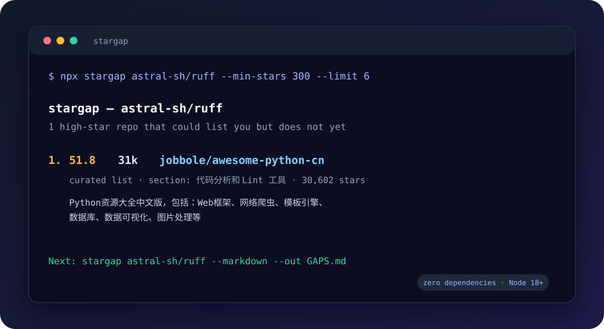

# stargap

**Find the high-star GitHub repos that should mention your project — but don't.**



You shipped something useful. The people who need it are reading an awesome-list that has never heard of you. `stargap` finds those lists, filters out the noise, ranks the real gaps, and gives you a paste-ready entry.

```console
$ npx stargap astral-sh/ruff --min-stars 300 --limit 6

stargap — astral-sh/ruff
1 high-star repo that could list you but do not yet

 1.  51.8     31k  jobbole/awesome-python-cn  curated list, section: 代码分析和 Lint 工具, 30,602 stars
    Python资源大全中文版，包括：Web框架、网络爬虫、模板引擎、数据库、数据可视化、图片处理等，由「开源前哨」和「Python开发者」微信公号团队维护更新。
```

One command. No signup, no dashboard, no growth-hacking SaaS.

[Full example report](docs/example-report.md) · [GitHub Action](action.yml)

## Why this exists

Getting stars is not only a code problem; it is also a distribution problem. A curated list that already ranks well can put your project in front of exactly the right users. Most maintainers never check which lists omit them, because checking by hand means reading hundreds of READMEs.

`stargap` does that reading for you.

## Quick start

```bash
npx stargap <owner/repo>
```

No install, no runtime dependencies, Node 18+.

```bash
# A Markdown report you can save and paste into an issue or PR
npx stargap acme/widget --markdown --out GAPS.md

# Machine-readable output for your own tooling
npx stargap acme/widget --json

# Only consider big lists
npx stargap acme/widget --min-stars 1000

# Target a specific ecosystem
npx stargap acme/widget --query "awesome in:name rust cli"
```

## Set a token (recommended)

Unauthenticated GitHub allows **60 core requests/hour** and only **10 search requests/hour**. A real scan can exhaust that quickly.

```bash
export GITHUB_TOKEN=ghp_xxx   # classic token, no scopes needed
npx stargap doctor            # shows remaining budget
```

Responses are cached in `~/.stargap/cache` for 24h, so repeat scans are nearly free. `stargap cache` clears it.

## What it actually does

1. **Profiles your repo** — topics, name, description and README become a weighted keyword set. Topics and headings count for more than body prose.
2. **Searches focused queries** — `awesome in:name <topic>` for each top topic, merged and de-duplicated. The `in:name` qualifier keeps the search focused on actual list repos instead of matching README prose.
3. **Filters to real curated lists** — a candidate must contain at least 15 Markdown links and 10 bullets, not just mention your topic in prose.
4. **Drops lists that already have you** — exact URL and `owner/repo` matches, plus guarded bare-name matching so `other` does not match `another`.
5. **Requires a genuine topic section** — the list must have a real section such as `Static Analysis` or `Package Management` that matches your project's declared identity. Generic headings like `Tools` and navigation headings like `Contents` do not count.
6. **Ranks the gaps** — relevance x list-ness x reach (log-scaled stars), with IDF so common ecosystem words carry less signal than your niche terms.
7. **Drafts the entry** — a ready-to-paste Markdown bullet based on your repository metadata.

## Scoring

| Signal | Weight | Why |
|---|---:|---|
| Relevance | 50% | A list about your topic is worth more than a big generic one |
| List-ness | 25% | Link collections accept entries; blog posts do not |
| Reach | 25% | `log10(stars)` — 100k stars is not 100x more valuable than 1k |

`--min-stars` filters first, then the score decides the order.

## Output

```json
{
  "schemaVersion": 1,
  "repo": "acme/widget",
  "gaps": [
    {
      "fullName": "awesome/awesome-cli",
      "stars": 12000,
      "score": 68.4,
      "section": "Package Management",
      "entry": "- [widget](https://github.com/acme/widget) - A tiny CLI that does the thing."
    }
  ]
}
```

## Using the results well

`stargap` tells you where you are missing. It does **not** open PRs for you — deliberately.

- Read each list's `CONTRIBUTING.md` and follow it exactly.
- Open **one PR per list**, explain why the entry fits that section, and keep it short.
- Never mass-open identical PRs. That is spam, it gets you blocked, and it burns the reputation you need later.
- Some lists only accept entries after a project passes a bar (stars, age, tests). Come back when you do.

The tool is a research aid. The judgment is yours.

## Commands

```text
stargap <owner/repo> [options]   Find gaps
stargap doctor                   Show token and rate-limit status
stargap cache                    Clear the local cache
```

| Flag | Default | Meaning |
|---|---:|---|
| `--min-stars <n>` | `100` | Ignore smaller repos |
| `--limit <n>` | `20` | Max gaps reported |
| `--candidates <n>` | `40` | Max candidates inspected |
| `--query <q>` | auto | Override the generated search |
| `--markdown` / `--json` | terminal | Output format |
| `--out <file>` | stdout | Write to a file |
| `--token <token>` | env | GitHub token |
| `--no-cache` | off | Bypass the cache |
| `--quiet` | off | Suppress progress |

## Programmatic use

```js
import { loadRepoProfile, findGaps } from "stargap";

const profile = await loadRepoProfile("acme/widget");
const gaps = await findGaps(profile, { minStars: 500 });
```

## GitHub Action

Run a weekly gap check without installing anything:

```yaml
- uses: jsxxwhai/stargap@v0.1.0
  with:
    min-stars: "1000"
    output: stargap-report.md
```

The report path is exposed as `steps.<id>.outputs.report`. See [examples/stargap.yml](examples/stargap.yml) for a scheduled workflow.

## Development

```bash
git clone https://github.com/jsxxwhai/stargap
cd stargap
npm test        # 33 tests, no network required
```

Everything is plain ESM with zero runtime dependencies. Tests inject fake `fetch` and search functions, so the suite never touches the network.

## Limits

- GitHub search caps at 1,000 results per query; `stargap` uses several focused queries instead of paging deep.
- List-ness, relevance and section matching are heuristics. Expect occasional false positives — check before you PR.
- It only knows what is in a README. Lists that track entries in a separate file or website are missed.
- The public GitHub API has low unauthenticated rate limits. Set `GITHUB_TOKEN` for regular use.

## Launching

Building something that deserves stars is not the same as getting them. The [launch plan](docs/launch.md) is the short, honest checklist used for this repository.

## License

MIT